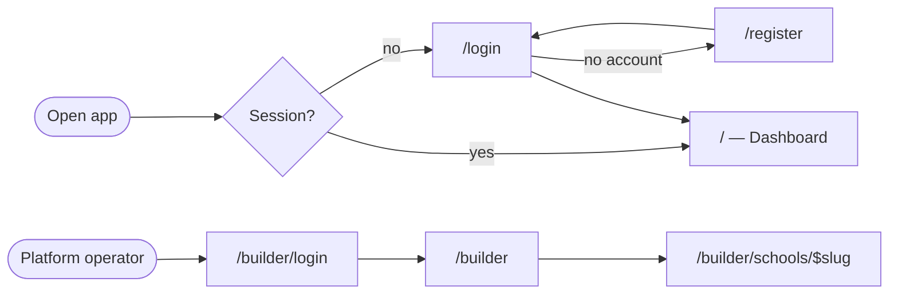
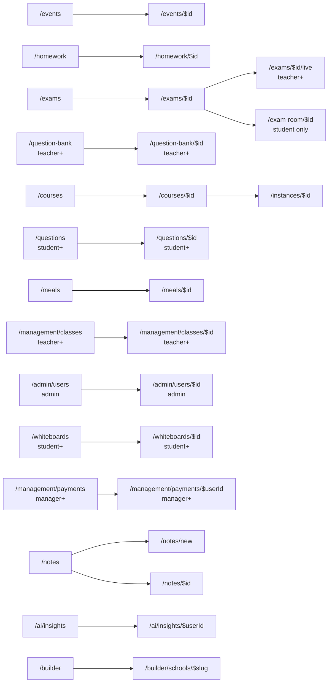

# Sitemap

Every route in the app, how it is reached, and who may enter it.

**Sources of truth** — this file is written by hand from them, so update it in the
same commit when either changes:

- `src/routes/router.tsx` — the route table (paths, params, redirects)
- `src/components/layout/nav-items.ts` — sidebar groups per role, module gates,
  the mobile tab bar
- `src/pages/*.tsx` — the `<RouteGuard>` each page wraps itself in

Role rank (`src/lib/roles.ts`): `parent (-1) < student (0) < teacher (1) < manager (2) < admin (3)`.
`minRole` is inclusive-upward, `maxRole` inclusive-downward, `exactRole` matches one role only.

## Entry flow

`RouteGuard` sends any unauthenticated visitor to `/login`; `guest-guard.tsx` does
the reverse for `/login`, `/register` and `/builder/login`. The `/builder/*`
pages sit behind `BuilderGuard` (the platform-operator session), not a school
role. None of these are in the sidebar.

## Sidebar per role

Each role has its own tree in `nav-items.ts` (`GROUPS_BY_ROLE`); manager and
admin share one tree and the manager simply qualifies for fewer items. An item
with a `module` is also hidden when the school has that module switched off
(`moduleVisible`). The Çelebi and "Ayarlar" rows open shell panels instead of
navigating, so they have no route.

### Admin / manager

| Group | Entries |
| --- | --- |
| Yapay zekâ | `/ai/studio` · `/ai/study` · `/ai/insights` · Çelebi |
| Okul yönetimi | `/management/students` (manager+) · `/management/teachers` (manager+) · `/management/classes` · `/management/academic-years` (manager+) · `/management/terms` (manager+) · `/calendar` |
| Eğitim ve içerik | `/courses` · `/homework` · `/exams` · `/question-bank` · `/questions` · `/notes` · `/whiteboards` |
| Öğrenci takibi | `/management/student-attendance` · `/management/student-marks` · `/management/pomodoros` |
| Okul hizmetleri | `/events` · `/appointments` · `/meals` |
| Kurum | `/management/payments` · `/management/staff-work` · `/work` · `/admin/users` (admin) · `/management/modules` (admin) · `/management/settings` |
| Yakında (folded) | `/coming-soon/deneme-sinavlari` · `/coming-soon/optik-okuma` · `/coming-soon/raporlar` · `/coming-soon/kvkk-denetim` (admin) |

### Teacher

| Group | Entries |
| --- | --- |
| Yapay zekâ | `/ai/studio` · `/ai/study` · Çelebi |
| Sınıfım | `/management/classes` · `/calendar` · `/courses` |
| Öğrenci takibi | `/management/student-attendance` · `/management/student-marks` · `/management/pomodoros` · `/ai/insights` ("Öğrenci analizi") |
| Eğitim ve içerik | `/homework` · `/exams` · `/question-bank` · `/ai/question-generation` · `/questions` · `/questions?status=pending` · `/notes` · `/whiteboards` |
| Diğer | `/messages` · `/appointments` · `/events` · `/meals` · `/work` · Ayarlar |

### Student

| Group | Entries |
| --- | --- |
| Yapay zekâ | `/ai/studio` · `/ai/study` · `/ai/insights` · Çelebi |
| Çalışma | `/marks` · `/exams` · `/homework` · `/pomodoro` |
| Eğitim ve içerik | `/courses` · `/notes` · `/questions` · `/whiteboards` |
| Diğer | `/calendar` · `/events` · `/messages` · `/appointments` · `/meals` · Ayarlar |
| Yakında (folded) | `/coming-soon/calisma-programim` |

### Parent

| Group | Entries |
| --- | --- |
| Yapay zekâ | `/ai/insights` |
| Öğrencim | `/students` · `/students/attendance` · `/students/exams` · `/students/study` |
| Kurum | `/payments` · `/appointments` · `/messages` · `/calendar` · `/events` · `/meals` · Ayarlar |

### Mobile tab bar

`PRIMARY_IDS_BY_ROLE` picks Home plus two entries from the role's own tree for
the phone tab bar (then the bar's own Search and Menu buttons):

| Role | Tabs |
| --- | --- |
| student | `/` · `/homework` · `/exams` |
| teacher | `/` · `/management/classes` · `/management/student-attendance` |
| manager, admin | `/` · `/management/students` · `/management/classes` |
| parent | `/` · `/students` · `/appointments` |

## Detail and nested routes

Reached by drilling into a list, never from the sidebar.

- `/courses/$id` is the catalog row; `/instances/$id` is a şube×ders instance
  (enrollments, exams, homework, sessions, roll call), reached from a course or
  a class.
- `/management/payments/$userId` renders the same `PaymentsPage` component as
  the list route — the param only deep-links a selected student.
- `/students/attendance`, `/students/exams` and `/students/study` render the
  same `MyStudentsPage` as `/students`, each on its own tab.
- `/notes/new` and `/notes/$id` share `NoteEditorPage`.
- `/profile/me` and `/profile/$userId` share `ProfilePage`; `/profile/me` is
  opened from the account menu, `/profile/$userId` from a person link.

## Redirects

| From | To | Why |
| --- | --- | --- |
| `/studies` | `/courses?kind=study` | Courses page filters by `kind` |
| `/clubs` | `/courses?kind=club` | same |
| `/ai` | `/ai/studio` | the old AI hub; each AI module has its own page now |
| `/sound-studio` | `/ai/studio` | the audio studio moved into AI Studio |
| `/attendance` | per role: student → `/marks?tab=attendance`, parent → `/students/attendance`, staff → `/management/student-attendance` | old link every role may still hold |

The first four are `beforeLoad` redirects with no component of their own;
`/attendance` waits for the session (`AttendanceRedirect`) because the target
depends on the role.

## Route guards at a glance

Route-level enforcement only — the sidebar hides more than this table blocks,
and the backend still scopes every read.

| Guard | Routes |
| --- | --- |
| `admin` | `/admin/users`, `/admin/users/$id`, `/management/modules` |
| `manager+` | `/management/students`, `/management/teachers`, `/management/academic-years`, `/management/terms`, `/management/settings`, `/management/staff-work`, `/management/payments`, `/management/payments/$userId` |
| `teacher+` | `/management/classes`, `/management/classes/$id`, `/management/student-marks`, `/management/student-attendance`, `/management/pomodoros`, `/question-bank`, `/question-bank/$id`, `/ai/question-generation`, `/exams/$id/live`, `/work` |
| `student+` | `/questions`, `/questions/$id`, `/whiteboards`, `/whiteboards/$id`, `/ai/studio`, `/ai/study` |
| `student` only | `/marks`, `/pomodoro`, `/exam-room/$id` |
| `parent` only | `/students`, `/students/attendance`, `/students/exams`, `/students/study` |
| signed-in, no role gate | `/`, `/notes`, `/notes/new`, `/notes/$id`, `/events`, `/events/$id`, `/homework`, `/homework/$id`, `/exams`, `/exams/$id`, `/courses`, `/courses/$id`, `/instances/$id`, `/calendar`, `/appointments`, `/meals`, `/meals/$id`, `/messages`, `/payments`, `/ai/insights`, `/ai/insights/$userId`, `/profile/me`, `/profile/$userId`, `/guide`, `/coming-soon/*` |
| builder session | `/builder`, `/builder/schools/$slug` |
| guest only | `/login`, `/register`, `/builder/login` |

Ungated routes that a role's sidebar does not list (a parent typing `/notes`,
say) stay reachable by URL — the data those pages show is scoped by the
backend, not by the router.

## Not in the sidebar

- `/guide` and `/profile/me` — opened from the account menu (`account-menu.ts`),
  shared by the desktop dropdown and the phone menu sheet.
- `/login`, `/register`, `/builder/*` — covered in [Entry flow](#entry-flow).
- 404 — `notFoundComponent` on the root route, links back to `/`.
