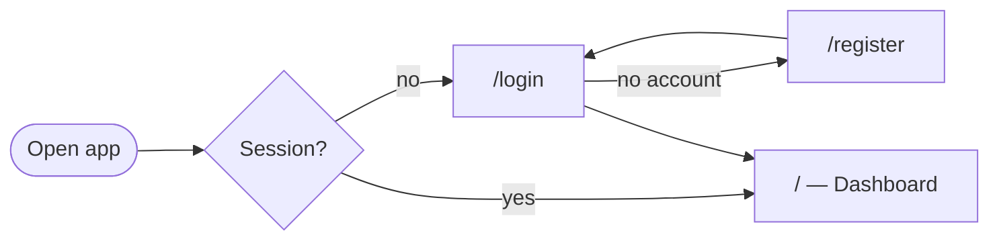
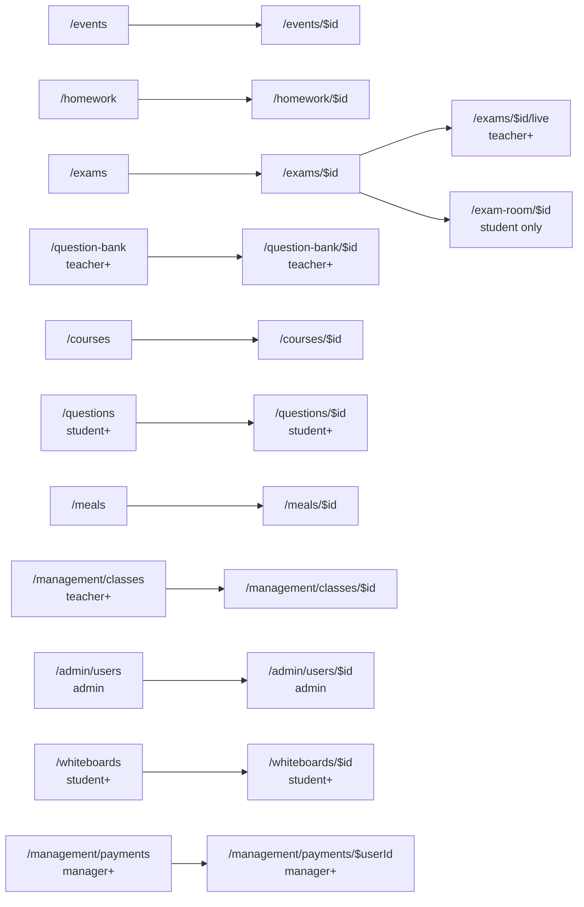

# Sitemap

Every route in the app, how it is reached, and who may enter it.

**Sources of truth** — this file is written by hand from them, so update it in the
same commit when either changes:

- `src/routes/router.tsx` — the route table (paths, params, redirects)
- `src/components/layout/nav-items.ts` — sidebar grouping and per-role visibility
- `src/pages/*.tsx` — the `<RouteGuard>` each page wraps itself in

Role rank (`src/lib/roles.ts`): `parent (-1) < student (0) < teacher (1) < manager (2) < admin (3)`.
`minRole` is inclusive-upward, `maxRole` inclusive-downward, `exactRole` matches one role only.

## Entry flow

`RouteGuard` sends any unauthenticated visitor to `/login`; `guest-guard.tsx` does
the reverse for `/login` and `/register`. Neither auth page is in the sidebar.

## Main sitemap

Grouped exactly as the sidebar groups them. Bracketed labels are the role gate —
unmarked entries are visible to every signed-in role except `parent` (see
[Parent visibility](#parent-visibility)).

```mermaid
flowchart TD
  Home["/ — Dashboard"]

  Home --> Classes["Dersler"]
  Home --> Planning["Planlama"]
  Home --> Workspace["Çalışma alanı"]
  Home --> Students["Öğrenciler"]
  Home --> Services["Hizmetler"]
  Home --> Community["Topluluk"]
  Home --> School["Okul"]

  Classes --> C1["/courses"]
  Classes --> C2["/homework"]
  Classes --> C3["/exams"]
  Classes --> C4["/question-bank<br/>teacher+"]
  Classes --> C5["/marks<br/>student only"]

  Planning --> P1["/events"]
  Planning --> P2["/calendar"]
  Planning --> P3["/appointments"]

  Workspace --> W1["/notes"]
  Workspace --> W2["/whiteboards<br/>student+"]
  Workspace --> W3["/pomodoro<br/>student only"]

  Students --> S1["/students<br/>parent only"]
  Students --> S2["/management/classes<br/>teacher+"]
  Students --> S3["/management/student-marks<br/>teacher+"]
  Students --> S4["/management/student-attendance<br/>teacher+"]
  Students --> S5["/management/pomodoros<br/>teacher+"]

  Services --> V1["/meals"]
  Services --> V2["/payments<br/>parent + student"]

  Community --> M1["/messages"]
  Community --> M2["/questions<br/>student+"]
  Community --> M3["/work<br/>teacher..manager"]

  School --> K1["/management/staff-work<br/>manager+"]
  School --> K2["/management/settings<br/>manager+"]
  School --> K3["/management/terms<br/>manager+"]
  School --> K4["/management/payments<br/>manager+"]
  School --> K5["/admin/users<br/>admin"]
```

### Primary strip

`PRIMARY_BY_ROLE` lifts a few of the above into the top strip / mobile tab bar
instead of the grouped sidebar:

| Role | Primary items |
| --- | --- |
| student | `/` · `/courses` · `/calendar` · `/marks` |
| teacher, manager, admin | `/` · `/courses` · `/calendar` |
| parent | `/` · `/students` · `/calendar` |

## Detail and nested routes

Reached by drilling into a list, never from the sidebar.

`/management/payments/$userId` renders the same `PaymentsPage` component as the
list route — the param only deep-links a selected student.

## Redirects

| From | To | Why |
| --- | --- | --- |
| `/studies` | `/courses?kind=study` | Courses page filters by `kind` |
| `/clubs` | `/courses?kind=club` | same |
| `/attendance` | `/marks?tab=attendance` | attendance is a tab on the marks page |

All three are `beforeLoad` redirects with no component of their own.

## Route guards at a glance

Route-level enforcement only — the sidebar hides more than this table blocks.

| Guard | Routes |
| --- | --- |
| `admin` | `/admin/users`, `/admin/users/$id` |
| `manager+` | `/management/settings`, `/management/terms`, `/management/staff-work`, `/management/payments`, `/management/payments/$userId` |
| `teacher+` | `/question-bank`, `/question-bank/$id`, `/management/student-marks`, `/management/student-attendance`, `/management/pomodoros`, `/exams/$id/live` |
| `teacher..manager` | `/work` |
| `student+` | `/questions`, `/questions/$id`, `/whiteboards`, `/whiteboards/$id` |
| `student` only | `/marks`, `/pomodoro`, `/exam-room/$id` |
| `parent` only | `/students` |
| signed-in, no role gate | `/`, `/notes`, `/events`, `/events/$id`, `/homework`, `/homework/$id`, `/exams`, `/exams/$id`, `/courses`, `/courses/$id`, `/management/classes`, `/management/classes/$id`, `/calendar`, `/appointments`, `/meals`, `/meals/$id`, `/messages`, `/payments`, `/guide` |

### Parent visibility

`itemVisible()` in `nav-items.ts` ends with an allowlist: a `parent` sees an
otherwise-ungated item only when its path is `/`, `/calendar`, `/appointments`,
`/meals` or `/messages`. Every other ungated route above is hidden from a parent's
sidebar but has no `RouteGuard`, so it stays reachable by typing the URL — the
data those pages show is scoped by the backend, not by the router.

The same gap applies to `/payments` (the personal statement page): the sidebar
shows it at `maxRole: "student"` (parent and student), while the route itself is
ungated.

## Not in the sitemap

- `/guide` — the in-app help page, reached from the account dropdown at the foot
  of the sidebar (`sidebar-account.tsx`), not from a nav group.
- `/login`, `/register` — pre-auth, covered in [Entry flow](#entry-flow).
- 404 — `notFoundComponent` on the root route, links back to `/`.
